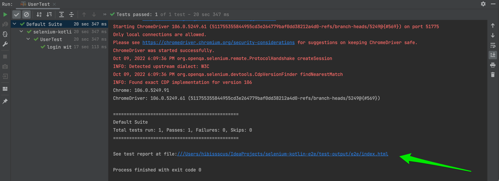

### Что хотелось бы улучшить:

- [ ] Тестов мало, хотелось бы увидеть больше кейсов, которых ты посчитаешь нужными;
    - Переработан `UserTest` - удален копипаст
    - Переработан `TodoTest` - каждый тест внутри класса теперь можно запустить из IDEA отдельно
    - Добавлен `TeamTest` - тест для проверки членов команды, а также временной доступности участников команды
    - Переработан `NavigationTest` - добавлена проверка панелей быстрого доступа

- [x] В тех тестах, что есть, не хватает ассертов. E.g: e2e.space.test.todo.TodoTest#02 todo list navigation - кажется, что проверки на стиль табика
  недостаточно
    - Переработан TodoTest - добавлена активация панели быстрого доступа перед переходом на страницу задач

- [x] Логин тест в каждом классе - не очень хорошее решение
    - login вынесен в отдельный метод класса `e2e.space.test.login.LoginTestBase` вызываемый в самом начале тестов 

- [x] Необходимость запускать тесты в хардкорной последовательности
    - В тесты добавлена testNG зависимость dependsOnMethods позволяющая определить зависимость между тестами
      класса 

- [x] Невозможно запустить один тест из IDE (п3) (все кроме логина)
    - Теперь каждый тест внутри класса можно запустить из IDEA отдельно (п4), для этого в IDEA необходимо выбрать "use IntelliJ
      IDEA" 

### Мысли и замечания:

- [ ] Почему бы не сделать не на GH actions, а на Space automation? - мы могли бы сделать там ревью.
- [x] docker-compose - зачем 3 ноды хрома? Можно скалировать сервис.
- [x] e2e.space.pages.google.GooglePage copy/paste
    - Ненужный тест и соответствующая ей страница были удалены
- [ ] testee.it.e2e.core.pages.WaitForLoaded#waitForLoaded - ненадежная проверка загрузки, лучше асинхронно.
- [x] e2e.space.pages.BasePage#isOpened etc. - странно что is*, не boolean.

- [x] e2e.space.test.login.UserTest - хочется параметризованных тестов тут (много копипаста).
- [x] e2e.space.pages.space.LoginPage#login(java.lang.String, java.lang.String) - а что если элемент не найдется из за баги? Оно не упадет.
- [x] ^^^ оба теста делают приблизительно одно и тоже. isUserNamePresent логичнее чекать в loginTest

- [x] Тесты с id > 01 не делает логин и падает (локальный запуск из идеи). Не очень удобно.
- [x] Из идеи не запустить весь класс, т.к. идея стартует класс через e2e таску.
- [x] Хочется ссылку на репорт в логе прогона тестов.
    - Добавлена ссылка в лог на отчет с результатами запуска теста 

- [x] 3 ноды браузеров - тесты параллелятся?
- [x] e2e.space.test.todo.TodoTest - зачем ожидания в конце каждого теста?
    - Данные временные ожидания были добавлены для демонстрации работы тестов на интервью, в текущей версии эти ожидания были удалены

### Minor:

- [x] doc: brew cask install chromedriver - Error: brew cask is no longer a brew command. Use brew <command> --cask instead.
    - `README.md` переработан, замечания были исправлены

- [x] gradle issue - повторный запуск тестов из command line не запускает тесты
  ``./gradlew test --tests "e2e.space.test.navigation.NavigationTest"``
  ``
  BUILD SUCCESSFUL in 1s
  3 actionable tasks: 3 up-to-date
  ``
  ``
  BUILD SUCCESSFUL in 1s
  3 actionable tasks: 3 up-to-date
  ``
    - Данный недостаток был исправлен в `build.gradle.kts` добавлен параметр `outputs.upToDateWhen { false }` исключающий переиспользование результата
      предыдущего запуска теста 

- [x] Хотелось бы конфигурацию для запуска тестов с браузерами в докере. И репорт, чтобы можно было посмотреть.
    - В `build.gradle.kts` добавлен плагин `docker-compose` запускающий в докер-контейнере selenium hub и selenium ноды хрома для параллельного
      запуска
      e2e тестов. В результате запуска тест кейсов формируется отчет доступный по ссылке в логе.
      ``./gradlew docker`` 