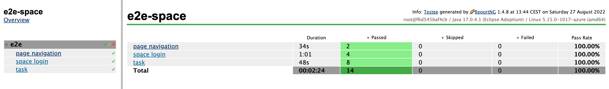
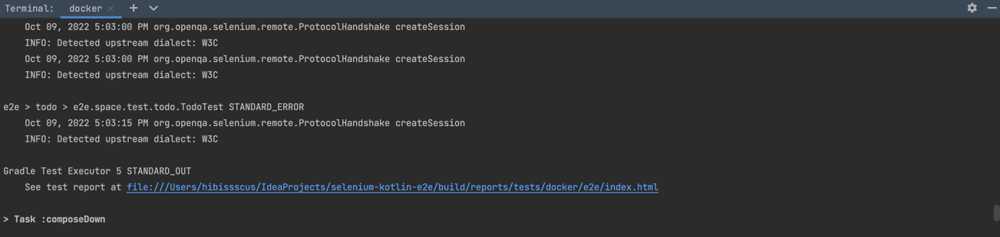

`Selenium` end-to-end test example for [Space](https://www.jetbrains.com/space/) 
=================================

Example of test results generated by 🌈 [ReportNG](https://github.com/hibissscus/reportng) with a help of
✅ [Testee](https://github.com/hibissscus/testee) framework: 

## Getting Started

- SSH clone URL: git@github.com:hibissscus/selenium-kotlin-e2e.git
- HTTPS clone URL: https://github.com/hibissscus/selenium-kotlin-e2e.git

## How to run E2E tests

1. `gradle` is used for building this `selenium-kotlin-e2e` project
2. To run `E2E` tests locally we need to install `chromedriver` or `geckodriver`
    - `brew install chromedriver` (or `brew upgrade chromedriver`)
    - `brew install geckodriver` (or `brew upgrade geckodriver`)
3. Go to `selenium-kotlin-e2e/src/test/kotlin/e2e/test/space` and run any of the test via IDEA with `test` profile (
   ex.: [TodoTest](https://github.com/hibissscus/selenium-kotlin-e2e/blob/master/src/test/kotlin/e2e/space/test/todo/TodoTest.kt))
   or via gradle:
   - ``./gradlew test --tests "e2e.space.test.navigation.NavigationTest"`` 
   - ``./gradlew test --tests "e2e.space.test.login.UserTest"``
   - ``./gradlew test --tests "e2e.space.test.team.TeamTest"``
   - ``./gradlew test --tests "e2e.space.test.todo.TodoTest"``
   - the whole e2e test suite can be started via gradle locally:
   ``./gradlew test``
4. For `Selenium` dockerization [docker-compose.yml](https://github.com/hibissscus/selenium-kotlin-e2e/blob/master/docker-compose.yml) file is used 
   - e2e test suite can be started via gradle using docker:
   ``./gradlew e2e`` 
   - test result report link can be found in the terminal log 

## GitHub Actions end-to-end test results via docker

👀 zip-arhive https://github.com/hibissscus/selenium-kotlin-e2e/suites/8163370723/artifacts/354560845

### Authors

© 2022 [Sergei Stepanov](https://github.com/hibissscus) (Initial idea, implementation & enhancement)
